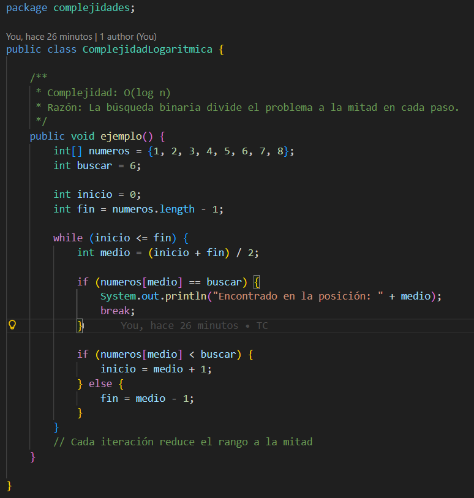
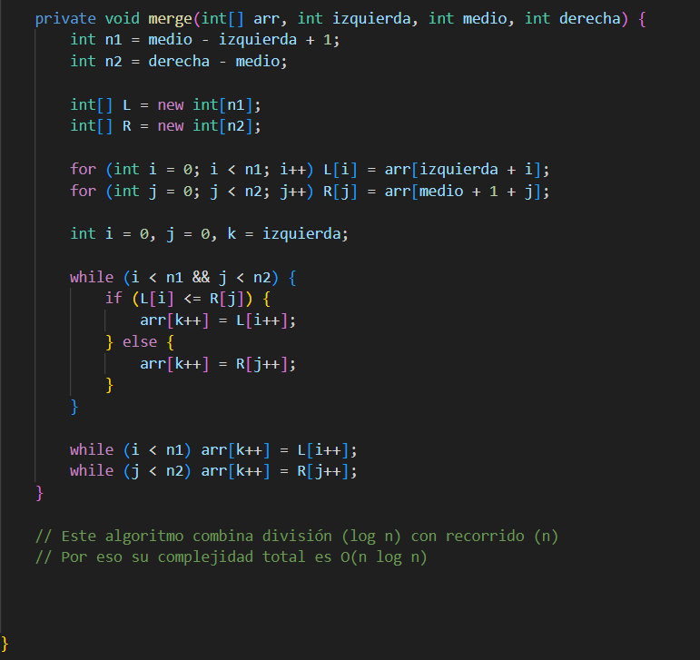

# **INFORME DE INVESTIGACION**


### **Asignatura:** Estructura de Datos

### **Tema:** Proyecto de Complejidad y Eficiencia de Algoritmos


# Integrantes:
- Xavier Josue Fajardo Zumba - https://github.com/Xavier369-ui/icc-est-u4-teoriaComplejidad.git
- Franklin Eduardo Ramon Saiteros- https://github.com/Xavier369-ui/icc-est-u4-teoriaComplejidad.git

# Objetivos:

1. Identificar y analizar la complejidad de algoritmos comunes o faciles comprendimiento su rendimiento. 

2. Implementar ejemplos prácticos en Java que permitan evaluar y comparar diferentes niveles de complejidad. 

3. Aplicar métodos de análisis teórico y práctico para para observar el comportamiento de los algoritmos con diferentes tamaños de entrada y condiciones.


# Marco Teórico:

La complejidad algorítmica es una rama fundamental de la informática que estudia el comportamiento y rendimiento de los algoritmos dependiendo el tamaño de los datos de entrada. Su objetivo es medir el uso de recursos, principalmente el tiempo de ejecución y la memoria, este determina si un algoritmo es eficiente o no. Este análisis es esencial porque permite anticipar cómo crecerá el costo computacional cuando aumente la cantidad de datos, esto afecta directamente los planes de viabilidad de un programa en situaciones reales, se necesita ver su eficiencia. 

Se distinguen dos tipos principales: la complejidad temporal, que se refiere al tiempo que toma de ejecución y la complejidad espacial, esta mide la cantidad de memoria adicional requerida. Estos valores dependen también de factores como el lenguaje de programación, la arquitectura del hardware y la implementación realizada por el programador.

Para expresar de forma estándar la eficiencia de los algoritmos se utiliza la notación Big O. Estas notaciones permiten describir cómo crece el costo computacional de un algoritmo y clasificarlo en categorías como O(1), O(n), O(log n) u O(n²). Gracias a estas notaciones es posible comparar algoritmos que resuelven el mismo problema y seleccionar según se necesite y requiera para tener un diseño más óptimo y eficiente. 

## **1. Teoría de la Complejidad** 

La teoría de la complejidad es una parte fundamental de la informática que se encarga de analizar cómo se comportan los algoritmos cuando aumenta el tamaño de los datos que deben procesar. Su propósito principal es medir el uso de recursos, especialmente el tiempo de ejecución y la memoria, para determinar si una solución es realmente eficiente. A través de este análisis es posible identificar qué métodos pueden manejar grandes cantidades de información y cuáles podrían volverse lentos o poco prácticos. Además, esta teoría proporciona herramientas formales, como la notación Big O, que permiten describir matemáticamente cómo crece el costo computacional de un algoritmo, facilitando la comparación entre distintas soluciones y ayudando a predecir su rendimiento futuro sin necesidad de probarlas en todos los escenarios posibles.

Estudiar la teoría de la complejidad también ayuda a desarrollar un criterio más sólido al momento de diseñar soluciones informáticas, ya que permite identificar qué partes de un algoritmo pueden optimizarse y cuáles representan posibles cuellos de botella. Esto no solo mejora el rendimiento general del programa, sino que contribuye a la creación de sistemas más eficientes, escalables y capaces de adaptarse a diferentes volúmenes de información. Gracias a este enfoque, es posible garantizar que las aplicaciones mantengan un buen desempeño en contextos reales, incluso cuando la demanda o la cantidad de datos crezca con el tiempo.

### 1.1 Definición general

La complejidad se define como la medida del costo computacional que requiere un algoritmo para ejecutarse, considerando principalmente el tiempo que tarda y la memoria que utiliza. Esta medida depende del tamaño de la entrada y se expresa mediante funciones que muestran cómo crecen los recursos necesarios a medida que aumentan los datos.

### 1.2 Importancia en la resolución de problema

La complejidad es importante porque permite determinar qué algoritmos resuelven un problema de manera eficiente y cuáles presentan dificultades cuando la entrada crece. Evaluarla ayuda a evitar soluciones que parecen correctas pero que no funcionan bien con datos más grandes, asegurando que el rendimiento del programa sea adecuado en distintos escenarios.

Además, comprender la complejidad facilita la elección de estructuras de datos y métodos más apropiados durante el desarrollo de software. Esto permite anticipar posibles cuellos de botella, optimizar el rendimiento y garantizar que la aplicación pueda adaptarse a diferentes condiciones sin perder eficiencia ni estabilidad.

### 1.3 Eficiencia de algoritmos

* Coste temporal
Es la cantidad de tiempo que un algoritmo tarda en ejecutarse. Este tiempo depende del número de operaciones que realiza en función del tamaño de los datos de entrada. A medida que aumentan los datos, el tiempo de ejecución puede aumentar en distintas proporciones (lineal, cuadrática, etc.).
* Coste espacial
Es la cantidad de memoria que un algoritmo necesita para ejecutarse. Incluye el espacio utilizado por variables, estructuras de datos y cualquier almacenamiento auxiliar requerido durante la ejecución del programa. Un algoritmo eficiente busca minimizar el uso innecesario de memoria.

La eficiencia de un algoritmo se refiere a qué tan bien utiliza los recursos del sistema para resolver un problema, principalmente el tiempo de ejecución y la memoria. Un algoritmo eficiente logra el resultado correcto utilizando la menor cantidad posible de recursos computacionales.

### 1.4 Factores de tiempo de ejecución 

Los factores de tiempo de ejecución influyen directamente en cómo se desempeña un algoritmo cuando procesa diferentes cantidades de datos. Estos factores permiten comprender por qué un algoritmo puede ser rápido en ciertas condiciones y más lento en otras, incluso si su complejidad teórica es la misma. Analizarlos es fundamental para entender el rendimiento real y para determinar si un algoritmo es adecuado para implementarse en un sistema específico.

Factores propios:
Son los factores que dependen directamente del diseño interno del algoritmo. Entre ellos se encuentran la cantidad de operaciones que realiza, la estructura de sus ciclos, la forma en que accede a los datos y la estrategia utilizada para resolver el problema. Estos elementos definen la complejidad teórica del algoritmo y permiten comparar su eficiencia con otros métodos.

Factores circunstanciales:
Son elementos externos al algoritmo que afectan su tiempo de ejecución. Incluyen la velocidad del procesador, la memoria disponible, el lenguaje de programación, la optimización del compilador, el sistema operativo y el tipo de hardware donde se ejecuta. Aunque no cambian la complejidad, sí influyen en el rendimiento real.

Análisis teórico:
Consiste en estudiar el algoritmo mediante modelos matemáticos como la notación Big O, Big Ω y Big Θ. Este análisis permite predecir cómo crecerá el tiempo de ejecución según el tamaño de la entrada, sin necesidad de ejecutar el programa. Es útil para comparar algoritmos de forma general y objetiva.

Análisis experimental:
Consiste en medir directamente el tiempo que tarda un algoritmo en ejecutarse usando diferentes tamaños de entrada. Este tipo de análisis muestra el comportamiento real del algoritmo en un entorno específico, teniendo en cuenta factores externos como el hardware o el lenguaje utilizado. La combinación del análisis teórico y experimental permite obtener una evaluación completa del rendimiento.

### 1.5 Notación de complejidad
La notación de complejidad permite expresar matemáticamente cómo crece el tiempo de ejecución de un algoritmo en relación con el tamaño de la entrada, facilitando su comparación y análisis.

Big O

La notación Big O representa el peor caso del algoritmo, es decir, el máximo tiempo que podría tardar en ejecutarse cuando recibe una entrada desfavorable.

Mejor caso

Es la situación más favorable, donde el algoritmo se ejecuta en el menor tiempo posible. Por ejemplo, en una búsqueda, si el elemento se encuentra en la primera posición.

Peor caso

Es el escenario donde el algoritmo tarda más tiempo en completarse, como cuando el elemento buscado está al final o no existe.

Caso promedio

Es el tiempo estimado considerando un conjunto general de datos, representando un comportamiento típico del algoritmo.

Big O, Ω, Θ

Big O (O): representa el límite superior del tiempo de ejecución (peor caso).

Omega (Ω): representa el límite inferior (mejor caso).

Theta (Θ): representa el comportamiento exacto del algoritmo cuando el tiempo crece de forma proporcional.

Estas notaciones permiten analizar y clasificar algoritmos según su rendimiento en diferentes situaciones.

* Big O
* Mejor caso
* Peor caso
* Caso promedio
* Big O, Ω, Θ

---

## **2. Ejemplos de Complejidad en Java**






---

## **2.1 Complejidad O(1) – Constante**

### **Archivo:** `ComplejidadConstante.java`

### **Código del ejemplo**

```java
public void ejemplo() {
    System.out.println("Ejemplo O(1)");
    int x = 10;
    int y = 5;
    int suma = x + y;
}
```
Este ejemplo corresponde a una complejidad O(1) porque todas las operaciones que realiza el método son constantes y no dependen del tamaño de los datos de entrada. El programa únicamente imprime un mensaje y ejecuta asignaciones y una suma simple, acciones que siempre toman el mismo tiempo sin importar si la entrada es pequeña o grande. No existe ningún ciclo o repetición que pueda aumentar el tiempo de ejecución por lo que su comportamiento es completamente constante, algo constante.
---

## **2.2 Complejidad O(n) – Lineal**

### **Archivo:** `ComplejidadLineal.java`

### **Código del ejemplo**

```java
public void ejemplo() {
    int[] numeros = {4, 7, 2, 9, 1, 5};
    for(int i = 0; i < numeros.length; i++){
        System.out.println(numeros[i]);
    }
}
```
Este ejemplo tiene una complejidad O(n) porque el tiempo de ejecución depende directamente de la cantidad de elementos presentes en el arreglo. El ciclo for recorre cada posición exactamente una vez, por lo que mientras más grande sea el arreglo, más iteraciones deberá realizar el algoritmo. Esto significa que el tiempo crece de manera proporcional al número de elementos, haciendo que el comportamiento sea lineal.
---

## **2.3 Complejidad O(n²) – Cuadrática**

### **Archivo:** `ComplejidadCuadratica.java`

### **Código del ejemplo**

```java
public void ejemplo() {
    int[] numeros = {5, 3, 8, 1, 2};
    for(int i = 0; i < numeros.length; i++){
        for(int j = 0; j < numeros.length; j++){
            System.out.println(numeros[i] + " - " + numeros[j]);
        }
    }
}
```
Este ejemplo tiene una complejidad O(n²) porque utiliza dos ciclos for anidados que recorren el arreglo completo. Por cada iteración del primer ciclo, el segundo ciclo vuelve a recorrer todos los elementos, lo que provoca que la cantidad total de operaciones crezca de manera cuadrática. Si el arreglo tiene n elementos, el algoritmo realiza n por n iteraciones asique lo que pasa es que el tiempo de ejecución aumenta mucho más rápido a medida que crece la entrada.
---

## **2.4 Complejidad O(log n) – Logarítmica**

### **Archivo:** `ComplejidadLogaritmica.java`

### **Código del ejemplo**

```java
public void ejemplo() {
    int n = 32;
    while(n > 1){
        n = n / 2;
        System.out.println(n);
    }
}
```
Este ejemplo corresponde a una complejidad O(log n) porque en cada iteración del ciclo el valor de n se reduce a la mitad, haciendo que la cantidad de repeticiones disminuya rápidamente. En lugar de recorrer todos los valores uno por uno, el algoritmo divide el tamaño del problema en cada paso, por lo que el tiempo de ejecución crece de forma logarítmica. Esto significa que aunque n aumenta mucho, el número de iteraciones solo crece de manera muy lenta.
---

## **2.5 Complejidad O(n log n) – N Log N**

### **Archivo:** `ComplejidadNLogN.java`

### **Código del ejemplo**

```java
public void ejemplo() {
    int[] numeros = {9, 3, 7, 5, 2, 8, 1};
    ordenar(numeros);
    for(int n : numeros){
        System.out.println(n);
    }
}

private void ordenar(int[] arr){
    java.util.Arrays.sort(arr);
}
```
Este ejemplo tiene una complejidad O(n log n) porque utiliza el método Arrays.sort(), este implementa algoritmos eficientes como QuickSort o MergeSort según el caso. Estos algoritmos dividen el problema repetidamente y realizan ordenamientos parciales, combinando pasos logarítmicos con recorridos lineales del arreglo. El resultado es que el tiempo de ejecución crece proporcionalmente a n multiplicado por log n, esto hace que este tipo de complejidad sea más eficiente que O(n²) y adecuada para ordenar grandes cantidades de datos.
---


# **Conclusiones**
Xavier Josue Fajardo Zumba :
El estudio de la teoría de la complejidad algorítmica fue crucial para entender que el rendimiento de los algoritmos varía significativamente con el aumento de los datos. Se demostró que la complejidad cuadrática, $O(n^2)$, es la más ineficiente, ya que el número de operaciones crece exponencialmente, consumiendo mucho más tiempo y reduciendo drásticamente el rendimiento en comparación con complejidades superiores  que son mucho más adecuadas para grandes volúmenes de información. Durante el proyecto, se aprendió a identificar cómo los bucles, las recursiones y las estructuras de datos afectan la eficiencia de un algoritmo, subrayando la importancia de evaluar el costo temporal y espacial antes de la implementación para evitar problemas de rendimiento, especialmente en sistemas con grandes cantidades de datos. Fue sorprendente constatar que ajustes mínimos en la estructura del código, como elegir entre un algoritmo de ordenamiento burbuja y Merge Sort, generan diferencias sustanciales en el tiempo de ejecución. En resumen, la comprensión de la teoría de la complejidad es fundamental, ya que no solo mejora la habilidad de programar de manera eficiente, sino que también fomenta una mentalidad crítica para diseñar soluciones óptimas, tomar mejores decisiones, economizar recursos y asegurar un alto desempeño de las aplicaciones desarrolladas.

Franklin Eduardo Ramon Saiteros:
El análisis de la complejidad permitió comprender cómo el tiempo de ejecución y el uso de memoria influyen en el rendimiento de los algoritmos. A través de los ejemplos implementados en Java se evidenció que cada tipo de complejidad se comporta de manera distinta según el tamaño de la entrada, lo que demuestra la importancia de seleccionar algoritmos adecuados para garantizar un buen desempeño en diferentes situaciones.

Comprender la complejidad algorítmica desde la formación académica nos prepara mejor para enfrentar los desafíos reales en el campo profesional. En ámbitos laborales como el desarrollo de software, análisis de datos, optimización de sistemas o ingeniería de aplicaciones, saber elegir y diseñar algoritmos adecuados permite crear soluciones mas rapidas es muy util. Esto no solo mejora la calidad del producto final, sino que también optimiza recursos, reduce costos operativos y facilita el mantenimiento del sistema, cualidades esenciales para destacarse como profesionales

El estudio reforzó la necesidad de evaluar tanto el análisis teórico como el experimental para entender completamente el comportamiento de un algoritmo. Esto permite identificar posibles limitaciones, optimizar el rendimiento y asegurar que las soluciones desarrolladas sean eficientes y escalables frente a distintos volúmenes de datos. 


---
